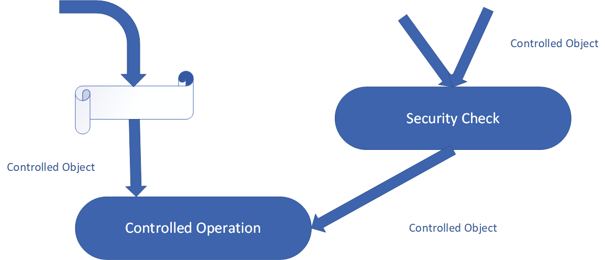

# Java_Spring_Notes
Some notes about Java Spring

## Planet Eris

## Secure Software Development Principles
Some of the earliest principles were proposed by Salzer in 1974. These 8 principles apply today as well.

### Economy of Mechanism
This is a widely known principle that applies to all aspects of a system, and software design and is particularly relevant
to security. Security mechanisms should be small and simple so that they can be easily implemented and verified. An example
is Security Kernel.

Complex designs increase the likelihood that errors will be made in their implementation, configuration, and use. Additionally,
the effort required to achieve an appropriate level of assurance increases dramatically, as security mechanisms become more
complex. As a result, it is generally more cost effective to spend more effort in the design of the system to achieve a simple
solution to the problem.

### Fail-Safe Defaults
Basing access decisions on permission rather than exclusion means that, by default, the access is denied and the protection
scheme identifies conditions under which access is permitted. If the security mechanism fails to grant access, this situation
can be easily detected and corrected. However, a failure to block access may fail by allowing access - which may go unnoticed
in normal use. Black listing and While listing data sensitization techniques fall under this category.

**Complete Mediation**: Every access to every object must be checked for authority. The figure below illustrates the concept:



The principle requires that access to every object must be checked for authority. It also requires that the source of every
request is positively identified and authorized to access a resource. Whenever a subject attempts to read an object, the OS
should mediate the action.

First, it determines if the subject is allowed to read the object. If so, it provides the resources for the read to occur.
If the subject tries to read the object again, the system should check that the subject is still allowed to read the object.
Most systems would not make the second check. They would cache the results of the first check and base the second access on
the cached results.

### Open Design
A software design is not secured by hiding it from potential attackers or obscurity of code. The design should not be a
secret. Encryption systems and access control mechanisms should be able to stand the open review and still be secure. We
can achieve this by decoupling of the protection mechanism from protection keys or passwords.

This approach brings the added advantage of permitting a thorough examination of the mechanism without concern that reviewers
can compromise the safeguards. Implementing an open design also allows users to verify that the protection scheme is adequate
for a particular application.

### Separation of Privilege
Where possible, a protection mechanism that requires two keys to unlock it is more robust and flexible than one that allows
access to the presenter of only a single key. Separation of privilege eliminates a single point of failure by requiring more
than 1 condition to grant permissions. A widely popular example is *"Two Factor Authentication"* which is based on
*"something you have"* and *"something you know"*.

### Least Privilege
Every program and every user of the system should operate using the least set of privileges necessary to complete the job.
This approach reduces the opportunities an attacker has to execute arbitrary code with elevated privileges. We can implement
this principle in the following ways:
* Grant each system, subsystem, and component the fewest privileges with which it can operate.
* Acquire and discard privileges in such a way that at any given point, the system only has the privileges it needs for the
  task in which it is engaged.
* Discard the privilege to change privileges if no further changes are required.
* Design programs to use privileges early, ideally, before interacting with a potential adversary (e.g a user), and then
  discard them for the remainder of the program.
  
### Least Common Mechanism
This principle, in some way, conflicts with overall trends in the distributed computing and dictates mechanisms common
to more than 1 user should be minimized because these mechanisms represent potential security risks. If a rogue user manages
to breach the security of one of these shared mechanisms, the attacker my be able to access or modify data from other users,
possible introducing malicious code into processes that depend on the resource. In order to avoid these scenarios, consider
designing your system so that the mechanism executes in the process space of your program and is not shared with other applications.

#### Psychological Acceptability
It is essential that the human interface be designed for ease of use, so that users routinely and automatically apply the
protection mechanisms correctly. The modern term for this principle is "usability". Usability is also a for of security because
user errors can often lead to security breaches--an example would be setting or changing access controls. Many of the
vulnerabilities in the US CERT Vulnerabilities Database can be attributed to usability problems. Other common usability issues
at the root cause of vulnerabilities cataloged in the database include:
* The program is hard to configure safely or is easy to misconfigure
* Installation of procedure creates vulnerability in other programs
* Configuration problems
* Confusing error and confirmation messages

Usability problems in the documentation can also lead to real-world vulnerabilities including insecure examples or insecure
descriptions. Overall, there are many good reasons to develop usable systems and perform usability testing and security
happens to be one of these reasons.

## Spring Security

### Retrieve user information
* Get the user via a custom interface => Look at app/security/IAuthenticationFacade
  * To fully leverage the Spring dependency injection and be able to retrieve the authentication everywhere, not just in
  `@Controller` beans, we need to hide the static access behind a simple facade.

### Roles and Privileges
First let's specify our entities
1. the User
2. the Role - this represents the high-level roles of the user in the system; each role will have a set of low-level
privileges
3. the Privilege - represents a low-level, granular privilege/authority in the system

As you can see, we're considering both the User <-> Role as well as the Role <-> Privilege relationships 
many-to-many bidirectional.

### Granted Authority vs Role
* Granted Authority
  * In Spring Security, we can **think of each GrantedAuthority as an individual privilege**. Examples could include READ_AUTHORITY,
  WRITE_PRIVILEGE, or even CAN_EXECUTE_AS_ROOT. The important thing to understand is that the name is arbitrary.
  * When using a GrantedAuthority directly, such as through the use of an expression like `hasAuthority('READ_AUTHORITY')`,
  we are **restricting access in a fine-grained manner**.
  * As you can probably gather, we can refer to the concept of authority by using privilege as well.
* Role Authority
  * Similarly, in Spring Security we can **think of each Role as a coarse-grained GrantedAuthority that is represented as
  a String and prefixed with "ROLE"**. When using a Role directly, such as through an expression like `hasRole('ADMIN')`,
  we are restricting access in a coarse-grained manner.
  * Note: The default "ROLE" prefix is configurable.
* **The core difference between these two is the semantics we attach to how we use the feature**. For the framework, the
difference is minimal - and basically deals with these in exactly the same way.
* Role as Container (Not implemented in this sample app, for reference use only)
  * Its an alternative to the role concept above. Uses roles as containers of authorities/privileges.
  * This is a higher level approach  to roles - making them more business-facing concept rather than an implementation
  centric one.
  * The Spring Security framework doesn't give any guidance in terms of how we should use the concept, so the choice is
  entirely implementation specific. 
  
  
  
### Spring Method Security
* Spring Security supports authorization semantics at the method level
* Typically, we could secure our service layer by, for example, restricting which roles are able to execute a particular
method--and test it using dedicated method-level security test support.
* Enabled Global Method Security. Look at app.security.WebSecurity.

### Applying Method Security
* Using the `@Secured` annotation
  * The `@Secured` annotation is used to specify a list of roles on a method. Hence, the user only can access that method
  if she has at least one of the specified roles.
  * ex: `@Secured({ROLE_ADMIN})`
  * The `@Secured` annotation doesn't support Spring Expression Language (SpEL)
* Using the `@RoleAllowed` annotation
  * The `@RoleAllowed` annotation is the JSR-250's equivalent annotation of the `@Secured` annotation
* Using `@PreAuthorize` and `@PostAuthorize` annotations
  * Both of these annotations provide expression-based access control. Hence, predicates can be written using SpEL
  * `@PreAuthorize` checks the given expression before entering the method, whereas, `@PostAuthorize` verifies it after
  the execution of the method and could alter the result.
  * ex: `@PreAuthorize("hasRole('ROLE_VIEWER')")`
  * `"hasRole('ROLE_VIEWER')"` is written using SpEL
  * Moreover, **we can actually use the method argument as part of the expression**
  * ex: 
  ```java
  public class SampleApp {
    @PreAuthorize("#username == authentication.principal.username")
    public String getMyRoles2(String username){
      // ...
    }
  }
  ```
  * **It's worth to note that `@PreAuthorize()` expressions can be replaced by `@PostAuthorize()` ones.**
  * Additionally, **the `@PostAuthorize()` annotation provides the ability to access the method result:**
  * ex: `@PostAuthorize("returnObject.username == authentication.principal.nickName")`
  * In the example above, the method would only execute successfully if the username of the returned object is equal
  to the current authentication principal's nickname.
* Security Annotation at the Class Level
  * If we find ourselves using the same security annotation for every method within one class, we can consider putting
  that annotation at class level.
* Multiple Security Annotations on a Method
  * We can also use multiple security annotations on one method.
* Important Considerations **IMPORTANT**
  * By default, Spring AOP proxying is used to apply method security - If a secured method A is called by another method
  within the same class, security in A is ignored altogether. This means method A will execute without any security
  checking. The same applies to private methods.
  * Spring *Security Context* is thread-bound - by default, the security context isn't propagated to child threads.
  
  
  
### Testing Spring Security
* Need the spring-security-test dependency
* We will run an integration test.
* Testing usernames and roles
  * Note: You can only test methods that you have secured with method security for roles

## Implementing JWT Authentication on Spring Boot APIs
### Securing RESTful APIs with JWTs

* *JSON Web Tokens*, aka JWTs, are tokens that are used to authenticate users on applications. This technology has gained
popularity over the past few years because it enables backends to accept requests simply by validating the contents of
these JWTs. That is, application that use JWTs no longer have to hold cookies or other session data about their users. This
characteristic facilitates scalability while keeping applications secure.

* During the authentication process, when a user successfully logs in using their credentials, a JSON Web Token is returned
and must be saved locally (typically in local storage). Whenever the user wants to access a protected route or resource (an endpoint),
the user agent must send the JWT, usually the `Authorization` header using the *Bearer schema*, along with the request.

* When a backend server receives a request with a JWT, the first thing to do is to validate the token. This consists of 
a series of steps, and if any of these fails then, the request must be rejected. The following list shows the validation
steps needed:
  * Check the JWT is well formed
  * Check the signature
  * Validate the standard claims
  * Check the Client permissions (scopes)
  
### Enabling User Registration on Spring Boot APIs
* `app.model.ErisUser` - entity used for app user
* `app.repositories.ErisUserRepository` - persistence layer for ErisUser
* `app.controllers.ErisUsersControllers` - controller so user can register
  
### User Authentication and Authorization on Spring Boot

To support both authentication and authorization in our app, we are going to:
* implement an authentication filter to issue JWTs to users sending credentials
* implement an authorization filter to validate requests containing JWTs
* create a custom implementation of `UserDetailsService` to help Spring Security loading user-specific data in the framework
* and extend the `WebSecurityConfigurerAdapter` class to customize the security framework to our needs

## Spring Test

### SpringJUnitConfig and SpringJUnitWebConfig
* `@SpringJUnitConfig`
  * combines both `@ExtendWith(SpringExtension.class)` from JUnit 5 and `@ContextConfiguration` to load the Spring context
  * note: in contrast to `@ContextConfiguration`, configuration classes are declared using the value attribute. However, 
  resource locations should be specified with the *locations* attribute
* `@SpringJUnitWebConfig`
  * combines same annotations as above plus `@WebAppConfiguration` to load the WebApplicationContext
  
### Goals of Integration Testing
1. To manage Spring IoC container caching between tests.
2. To provide dependency injection to test fixture instances
3. To provide transaction management appropriate to integration testing
4. To supply spring specific base classes that assist developers in writing integration tests.

### Spring MVC Test
* The goal of Spring MVC Test is to provide an effective way to test controllers by performing requests and generating
responses through the actual DispatcherServlet
* Setup Features
  * All `MockMvcBuilder` implementations provide some common and very useful features. For example, you can declare an
  `Accept` header for all requests and expect a status of 200 as well as a `Content-Type` header in all responses, as
  follows:
  ```java
  MockMvc mockMvc = = standaloneSetup(new MusicController())
        .defaultRequest(get("/").accept(MediaType.APPLICATION_JSON))
        .alwaysExpect(status().isOk())
        .alwaysExpect(content().contentType("application/json;charset=UTF-8"))
        .build();
  ```
  
  
  
  
  
  
  
## Spring Mail
* Mail Server Properties
  1. `MailSender` interface: The top-level interface that provides basic functionality for sending simple emails
  2. `JavaMailSender` interface: the subinterface of the above `MailSender`. It supports MIME messages and is mostly used
  in conjunction with the `MimeMessageHelper` class for the creation of a `MimeMessage`. It's recommended to use the 
  `MimeMessagePreparator` mechanism with this interface.
  3. `JavaMailSenderImpl` class: provides an implementation of the `JavaMailSender` interface. It supports the `MimeMessage`
  and `SimpleMailMessage`
  4. `SimpleMailMessage` class: used to create a simple mail message including the from, to, cc, subject and text fields
  5. `MimeMessagePreparator` interface: provides a callback interface for the preparation of MIME messages
  6. `MimeMessageHelper` class: helper class for the creation of MIME messages. It offers support for images, typical mail
  attachments and text content in an HTML layout.
  
  
  
  
  
  
## Spring Actuator
* An actuator is a manufacturing term that refers to a mechanical device for moving or controlling something. Actuators
can generate a large amount of motion from a small change.
* Endpoints
  * Actuator endpoints let you monitor and interact with your application. Spring Boot includes a number of built-in
  endpoints and lets you add your own. For example, the `/actuator/health` endpoint provides basic application health
  information
* Exposed endpoints are set in /resources/application.yml
* Health Information
  * You can use health information to check the status of your running application. It is often used by monitoring software
  to alert someone when a production system goes down. The information exposed by the `'health` endpoint depends on the
  `management.endpoint.health.show-deatils` property which can be configured with one of the following values:
    * `never`: details are never shown
    * `when-authorized`: details are only shown to authorized users. Authorized roles can be configured using
    `management.endpoint.health.roles`
    * `always`: details are shown to all users
* Application Information

## Spring Exceptions

A RESTful application can communicate the success or failure of an HTTP request by **returning the right status code in
the response to the client**. Simply put, an appropriate status code can help the client to identify problems that might
have occurred while the application was dealing with the request.